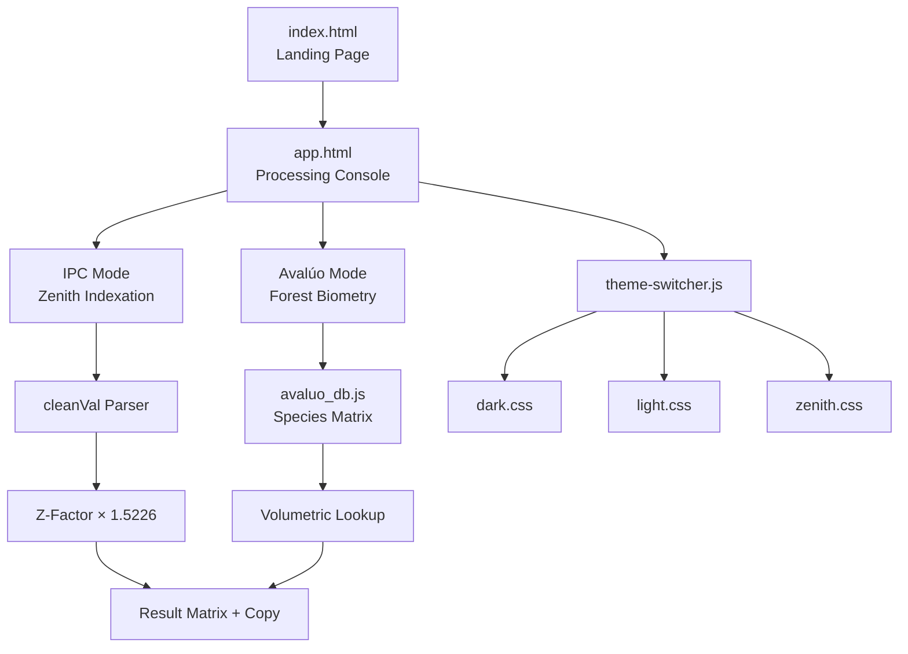

# Architecture — E.V.A. PRO v2.5.1

## System Overview



## 1. Calculation Topology

### 1.1 Forest Appraisal Engine (Avalúo Biológico)

The engine operates as a **Bidimensional Lookup Table**:

| Axis | Parameter | Source |
|---|---|---|
| **X (Girth)** | Trunk diameter at breast height (DAP) in cm | IGAC/CAR Manual |
| **Y (Height)** | Commercial fuste height in meters | Field inventory |
| **Category** | Species classification (1st, 2nd, 3rd) | Botanical taxonomy |

**Algorithm:**
```
Species → Category → Price Matrix[girth_range][height] → Base Value
Base Value × Z-Factor → Present Value (IPC-adjusted)
```

### 1.2 IPC Indexation Engine (Corrección Inflacionaria)

The **Zenith Factor (`Z = 1.5226`)** is a compound accumulator:

```
Z = Π(1 + IPC_year)     for year ∈ [2018, 2025]
  = 1.038 × 1.0357 × 1.053 × 1.0551 × 1.1318 × 1.0928 × 1.0545
  = 1.5226
```

**Data Source:** [DANE IPC Series](https://www.dane.gov.co/index.php/estadisticas-por-tema/precios-y-costos/indice-de-precios-al-consumidor-ipc)

**Input Parser** supports:
- Single values per line
- Tab-separated multi-column (40% / 60% / 70% / 100%)
- Colombian currency format: `$ 1.234.567,89`

## 2. Theme Architecture

All visual tokens are defined via CSS Custom Properties:

| Variable | Purpose |
|---|---|
| `--bg-obsidian` | Page background |
| `--bg-panel` | Card/panel background |
| `--primary` | Accent color (interactive elements) |
| `--primary-glow` | Shadow/glow radiants |
| `--text-main` | Primary text color |
| `--text-dim` | Secondary/label text |
| `--border-glass` | Glass-morphism borders |

Theme switching replaces the CSS file via `theme-switcher.js` and persists selection in `localStorage`.

## 3. Performance Architecture

| Technique | Applied To |
|---|---|
| `requestAnimationFrame` | Particle engine, parallax, magnetic effects |
| `will-change: transform` | Interactive cards, CTA button |
| `translate3d()` | GPU-accelerated transforms |
| Passive event listeners | Mouse tracking (`{ passive: true }`) |
| `backdrop-filter` throttle | Limited to primary panels only |

## 4. File Responsibility Matrix

| File | Role | Dependencies |
|---|---|---|
| `index.html` | Landing page, module showcase, SEO | `dark.css`, `theme-switcher.js`, Lucide |
| `app.html` | Dual-mode processing console | `avaluo_db.js`, Chart.js, Lucide |
| `avaluo_db.js` | Species database + pricing matrix | None |
| `theme-switcher.js` | Persistent theme engine | Chart.js (optional sync) |
| `css/themes/*.css` | Visual token definitions | None |
| `css/base.css` | Shared component styles (legacy) | Theme CSS |

---

**DGZ Engineering Lab** © 2026
