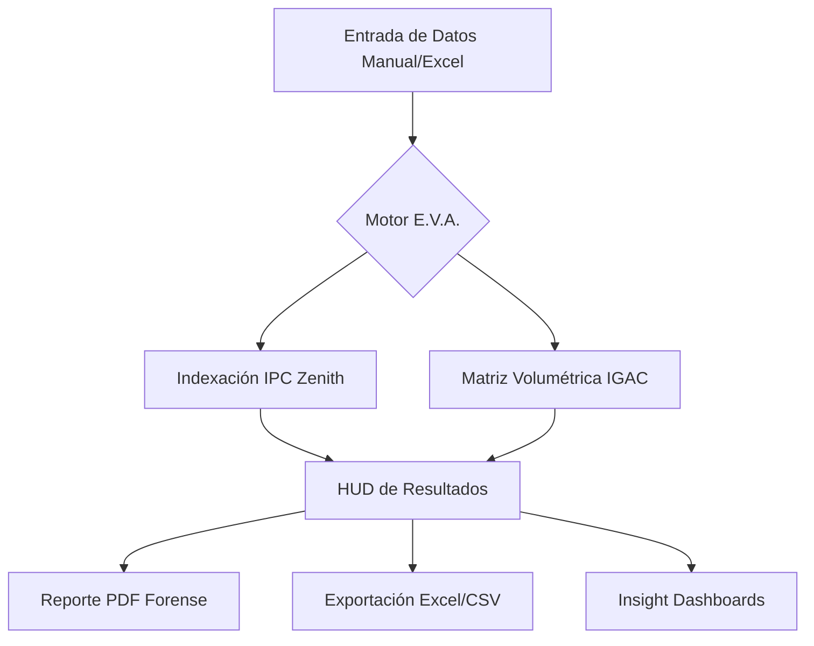

  

<h1 align="center">E.V.A. — Biological Asset Intelligence</h1>

  <strong>Motor Forense de Valoración de Activos Biológicos e Indexación Monetaria (Colombia)</strong>

  
  
  
  

  <em>Desarrollado por <a href="https://github.com/Daga21Gz">Daga21Gz</a> / <strong>DGZ Engineering Lab</strong> · Medellín, Colombia</em>

---

## 💎 Propuesta de Valor Forense

**E.V.A. (Experto en Valoración de Activos)** es una suite de ingeniería *serverless* diseñada para peritos avaluadores, ingenieros forestales y peritos judiciales. Automatiza la complejidad de la actualización monetaria y la biometría forestal bajo estándares colombianos oficiales.

### 🚀 Capacidades Principales
- **Motor Zenith (IPC):** Sincronización masiva de valores históricos (2018-2025) usando el factor acumulado oficial del DANE (`1.5226`).
- **Biometría Forestal:** Cálculo volumétrico y valoración comercial de más de 70 especies protegidas y comerciales.
- **Analítica de Grado Pericial:** Generación automática de gráficos de distribución, calidad biológica y comparativas de mercado.
- **Actualización en Tiempo Real:** Sistema centralizado vía GitHub que sincroniza cambios a todos los usuarios activos de forma automática.

---

## 🏗️ Ficha Técnica y Arquitectura

El sistema opera bajo una arquitectura **Zero-Infrastructure**, garantizando privacidad total (los datos no salen del navegador) y operatividad sin conexión.

### Stack Tecnológico
*   **Engine:** Vanilla JavaScript (ES2023)
*   **UI/UX:** Glassmorphism Design System (CSS3 Custom Properties)
*   **Charts:** Chart.js High-Performance Suite
*   **Deployment:** GitHub Pages CI/CD
*   **PWA:** Service Worker con estrategia de actualización inmediata

---

## 📊 El Factor Zenith (`1.5226`)

La precisión es nuestra prioridad. El **Factor Zenith** es el acumulador compuesto de inflación oficial en Colombia:

$$Z = \prod_{year=2018}^{2025} (1 + IPC_{year})$$

| Año | IPC Dec. | Acumulado |
| :--- | :--- | :--- |
| **2018** | Base | 1.0000 |
| **2021** | 5.62% | 1.1318 |
| **2023** | 9.28% | 1.3920 |
| **2025 (Proj)** | 5.45% | **1.5226** |

---

## 🛠️ Instalación y Uso

No requiere instalación. E.V.A. es una herramienta portátil y lista para campo.

1.  Acceda a la [Plataforma Live](https://daga21gz.github.io/ACT-IPC/app.html) (GitHub Pages).
2.  **Modo IPC:** Pegue valores desde Excel y ejecute.
3.  **Modo Avalúo:** Pegue datos biométricos (`Especie | DAP | Altura`) y obtenga la valoración total instantánea.

---

## 📜 Marco Legal y Cumplimiento

E.V.A. está diseñado para soportar procesos de debida diligencia y peritajes judiciales en Colombia:
- **IGAC:** Metodologías de valoración catastral y comercial (Res. 620/2008).
- **DANE:** Índice de Precios al Consumidor oficial.
- **MinAmbiente:** Clasificación de especies y vedas forestales.

---

## 📝 Licencia y Contribución

Este proyecto está bajo la Licencia **MIT**. Las contribuciones deben seguir el protocolo de ingeniería definido en [`CONTRIBUTING.md`](CONTRIBUTING.md).

---

  <strong>DGZ Engineering Lab</strong> © 2026 
  <em>Automating the Future of Cadastral & Environmental Appraisal</em> 🌍

